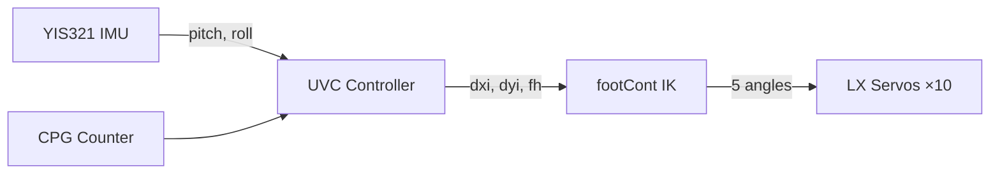
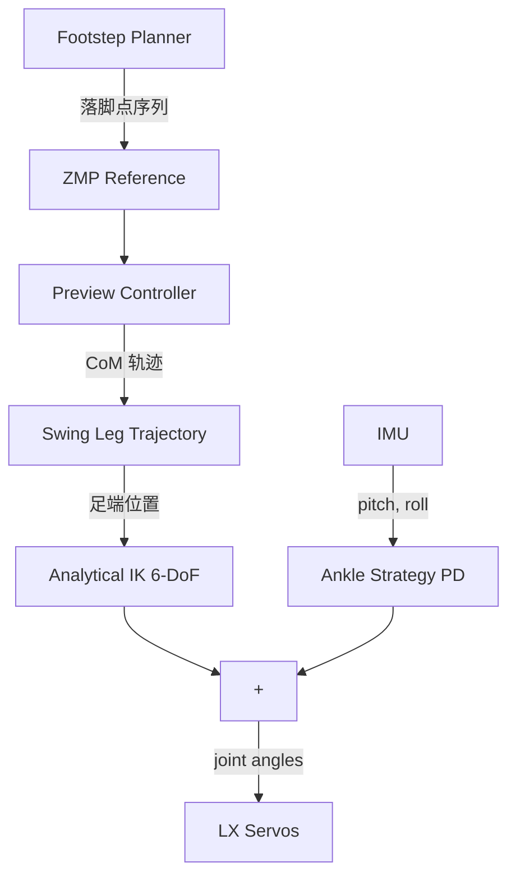

# 双足步行控制 — 优化路线图

> 从当前 UVC 实现出发，分阶段向 ZMP/LIPM 架构演进。

---

## 当前架构概览



**特点**: UVC 本质是一个 **积分式倾斜补偿器** — 检测到倾斜 → 修正支撑腿横/纵偏移 → IK 解算新角度。简洁但粗糙。

---

## Phase 0: 补全当前差距 (1-2天)

> 修复 walk_imu.py 中与 robot_ctrl.c 的已知差异

### 0.1 着地冲击吸收

[uvc_sub()](file:///C:/GitHub/servo_robot_temp/tools/walk_imu.py#204-230) 中补入着地时腿长缩短逻辑:

```python
# 着地期: 缩短腿长吸收冲击
if self.fwct > self.fwctEnd - self.landB and rollt > 0:
    shock = (abs(self.dyi - self.dyib) + abs(self.dxi - self.dxib)) * 0.02
    self.autoH -= shock
```

### 0.2 完善 swCont 横摆方向耦合

```python
def sw_cont(self):
    k = self.swMax * math.sin(math.pi * self.fwct / self.fwctEnd)
    t = math.atan2(abs(self.dxi), max(self.dyi, 0.01))
    if self.dxi > 0:
        self.swx = k * math.sin(t)
    else:
        self.swx = -k * math.sin(t)
    self.swy = k * math.cos(t)
```

### 0.3 添加 uvcSub2 (恢复步态模式)

用于 `--mode balance` 跌倒后恢复:

```python
def uvc_sub2(self):
    """恢复步态: 所有偏移按剩余周期线性归零"""
    remain = self.fwctEnd - self.fwct + 1
    k1 = self.dyi / remain
    k0 = self.dxi / remain
    self.dyi -= k1
    self.dxi -= k0
    if self.fwct <= self.landF:
        self.dyis += k1
        self.dxis -= k0
    else:
        self.dyis -= self.dyis / remain
        self.dxis -= self.dxis / remain
    self.autoH += (HEIGHT - self.autoH) / remain
```

---

## Phase 1: 轨迹质量提升 (3-5天)

> 当前用 [sin()](file:///C:/GitHub/servo_robot_temp/tools/test_walk.py#410-562) 曲线驱动关节，起止点速度/加速度不为零，会产生冲击。

### 1.1 摆线 (Cycloid) 足端轨迹

替换简单正弦抬脚，改用摆线保证起止零速度零加速度:

$$x(s) = s - \frac{1}{2\pi}\sin(2\pi s), \quad z(s) = 1 - \cos(2\pi s)$$

其中 $s = (t - t_0) / T_{swing} \in [0,1]$

```python
def cycloid_trajectory(phase, stride, lift_height):
    """摆线轨迹: 起止速度=0, 加速度=0"""
    x = stride * (phase - math.sin(2*math.pi*phase) / (2*math.pi))
    z = lift_height * (1 - math.cos(2*math.pi*phase)) / 2
    return x, z
```

**好处**: 落地冲击从 sin 的 ~50% 峰值速度降为 0，极大保护舵机齿轮。

### 1.2 三次贝塞尔插值轨迹

更灵活，可控制中间点:

$$\mathbf{P}(t) = (1-t)^3 P_0 + 3(1-t)^2 t P_1 + 3(1-t)t^2 P_2 + t^3 P_3$$

```python
def bezier_foot_trajectory(phase, start, end, lift):
    """三次贝塞尔足端轨迹"""
    P0 = (start, 0)      # 起点(地面)
    P1 = (start, lift)    # 控制点1(抬起)
    P2 = (end, lift)      # 控制点2(最高点)
    P3 = (end, 0)         # 终点(地面)
    t = phase
    x = (1-t)**3*P0[0] + 3*(1-t)**2*t*P1[0] + 3*(1-t)*t**2*P2[0] + t**3*P3[0]
    z = (1-t)**3*P0[1] + 3*(1-t)**2*t*P1[1] + 3*(1-t)*t**2*P2[1] + t**3*P3[1]
    return x, z
```

### 1.3 PD 踝关节柔顺控制 (Ankle Strategy)

替换 UVC 的纯积分补偿，改用直接的 PD 反馈:

$$\Delta\theta_{ankle} = K_p \cdot e_{pitch} + K_d \cdot \dot{e}_{pitch}$$

```python
class AnkleStrategy:
    def __init__(self, kp=0.3, kd=0.05):
        self.kp, self.kd = kp, kd
        self.prev_error = 0

    def compute(self, pitch_error, dt):
        d_error = (pitch_error - self.prev_error) / dt
        self.prev_error = pitch_error
        return self.kp * pitch_error + self.kd * d_error
```

**好处**: 比 UVC 的积分式响应更快，不容易过冲。可与 UVC 叠加使用。

---

## Phase 2: 解析逆运动学升级 (1周)

> 当前 [footCont](file:///d:/servo_robot_learn-master/main_code/src/main.c#403-448) 是几何法简化解，忽略了 Hip Yaw(偏航)轴。

### 2.1 完整 6-DoF 解析 IK

利用机器人结构特点 (Hip Roll/Pitch 轴交汇, Ankle Pitch/Roll 轴交汇):

```
给定: 骨盆位姿 T_pelvis, 足端目标位姿 T_foot
求解: 6个关节角 [hip_yaw, hip_roll, hip_pitch, knee, ankle_pitch, ankle_roll]
```

**解法** (利用相交轴解耦):

1. **Hip Yaw**: 从骨盆到足端的投影方向直接求解
2. **膝关节 (余弦定理)**:
   $$\theta_{knee} = \cos^{-1}\!\left(\frac{l_1^2 + l_2^2 - d^2}{2 l_1 l_2}\right)$$
3. **Hip Roll + Pitch**: 用 `atan2` 从剩余几何关系解出
4. **Ankle Pitch + Roll**: 保持脚掌与地面平行, 从 IMU 数据补偿

**好处**: 支持 hip_yaw 实现转向行走，且避免 IK 奇异点。

---

## Phase 3: ZMP/LIPM 步态规划 (2-4周)

> 从 CPG 正弦曲线 → 基于物理的动态步态

### 3.1 线性倒立摆模型 (3D-LIPM)

核心动力学:

$$\ddot{x}_{com} = \frac{g}{h}(x_{com} - x_{zmp})$$

其中 $h$ 为质心高度 (恒定), $g=9.81$。

给定落脚点序列 → ZMP 参考轨迹 → 反推质心轨迹。

### 3.2 ZMP 预瞄控制器 (Kajita Preview Control)

离散化 LIPM 为状态空间:

$$\mathbf{x}_{k+1} = A\mathbf{x}_k + B u_k, \quad y_k = C\mathbf{x}_k$$

LQR 最优控制 + N步前瞻:

$$u_k = -K_I \sum e_i - K_x \mathbf{x}_k + \sum_{j=1}^{N} f_j \cdot zmp_{ref}(k+j)$$

```python
class PreviewController:
    def __init__(self, dt, com_height, preview_steps=160):
        self.dt = dt
        omega = math.sqrt(9.81 / com_height)
        # 状态空间矩阵 [x, dx, ddx]
        self.A = np.array([[1, dt, dt**2/2],
                           [0, 1, dt],
                           [0, 0, 1]])
        self.B = np.array([[dt**3/6], [dt**2/2], [dt]])
        self.C = np.array([[1, 0, -com_height/9.81]])
        # 求解 LQR 增益 (离线计算一次)
        self.K_x, self.K_I, self.f = self._solve_preview_gain(preview_steps)
```

### 3.3 落脚点规划

```python
def plan_footsteps(n_steps, stride, width):
    """交替左右脚落脚点"""
    steps = []
    for i in range(n_steps):
        x = i * stride
        y = width/2 if i % 2 == 0 else -width/2
        steps.append((x, y))
    return steps
```

### 3.4 完整控制流



---

## Phase 4: 进阶传感与自适应 (远期)

| 方向 | 说明 | 硬件需求 |
|------|------|---------|
| 触地检测 | 读舵机电流突变判断是否着地 | 无 (LX 支持电流读取) |
| 力矩估计 | 从舵机电流反推脚底反力 | 无 |
| FSR 压力 | 脚底贴薄膜压力传感器 | ~¥10/片 |
| 地形自适应 | 前一步触地高度差 → 调整下一步抬脚 | FSR |
| 步态学习 | 强化学习优化步态参数 | GPU/仿真 |

---

## 优先级建议

```mermaid
gantt
    title 优化路线图
    dateFormat  X
    axisFormat %s

    section Phase 0
    补全 UVC 差距           :done, 0, 2
    section Phase 1
    摆线轨迹               :active, 2, 4
    PD 踝关节补偿           :4, 6
    section Phase 2
    解析 IK 6-DoF          :6, 10
    section Phase 3
    LIPM + ZMP 预瞄        :10, 20
    section Phase 4
    触地检测/自适应         :20, 28
```



> [!TIP]
> **建议先做 Phase 0 + Phase 1.1 (摆线轨迹)**，实测后再决定是否进入 Phase 2/3。ZMP/LIPM 是重型方案，对机器人重量分布和舵机精度有较高要求，不一定在舵机平台上能体现优势。UVC + 好的轨迹 + PD 踝关节补偿可能已经够用。
